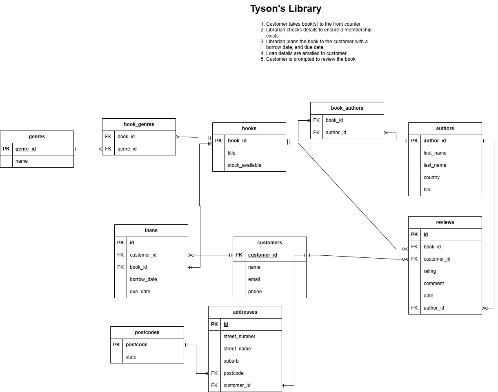

# **Library Database System**  

## **Overview**  
This assessment project is a **PostgreSQL** database for a library system that tracks books, customers, loans, and reviews. The database includes queries for **data aggregation, filtering, and table joins** to analyse library data effectively.  

---

## **Installation Guide**  

### **1. Prerequisites**  
Ensure you have **PostgreSQL** installed on your system.  
- Download from: [https://www.postgresql.org/download/](https://www.postgresql.org/download/)  
- Install and start the **PostgreSQL** service.  

### **2. Setting Up the Database**  
1. Open **PostgreSQL** (Linux/WSL) 
    ```bash
    sudo -u postgres psql
    ```
    (MacOS)
    ```bash
    psql
    ```  
2. Create a new database:  
   ```sql
   create database tysons_library;
   ```  
3. Connect to the database:  
   ```sh
   \c tysons_library;
   ```  
4. Run the database creation script:  
   ```sh
   \i database_creation.sql
   ```  
   This will create all tables, constraints, and relationships.

---

## **ERD (Entity Relationship Diagram)**  
The **tysons_library_erd.png** file contains a **visual representation** of the database structure. You can open it using any image viewer.  


---

## **Query Scripts**  

### 📌 **1. `average_genre_rating.sql`**  
**Purpose:** Calculates the average rating for each book genre.  
**Run:**  
```sql
\i average_genre_rating.sql
```

### 📌 **2. `books_available.sql`**  
**Purpose:** Lists books with **authors, genres, and stock availability**.  
**Run:**  
```sql
\i books_available.sql
```

### 📌 **3. `customer_reviews_amount.sql`**  
**Purpose:** Displays **the number of reviews** each customer has submitted.  
**Run:**  
```sql
\i customer_reviews_amount.sql
```

### 📌 **4. `loaned_books.sql`**  
**Purpose:** Shows **books currently loaned out**, including customer details and due dates.  
**Run:**  
```sql
\i loaned_books.sql
```

### 📌 **5. `show_all_reviews_info.sql`**  
**Purpose:** Retrieves **detailed review information** for books, including ratings.  
**Run:**  
```sql
\i show_all_reviews_info.sql
```

### 📌 **6. `new_customers_borrow.sql`**  
**Purpose:** Inserts **some new customers and logs some book loans**, while automatically updating stock.  
**Run:**  
```sql
\i new_customers_borrow.sql
```

---

## **Triggers & Constraints**  
This database includes **data integrity constraints** to ensure:  
✅ **Reviews are linked to valid customers and books.**  

---

## **Testing & Validation**  
- Run `SELECT * FROM books;` to check book availability.  
- Try **borrowing a book** by inserting into the `loans` table.  

---

## **Author**  
**Tyson Williams** – Coder Academy Student

---
